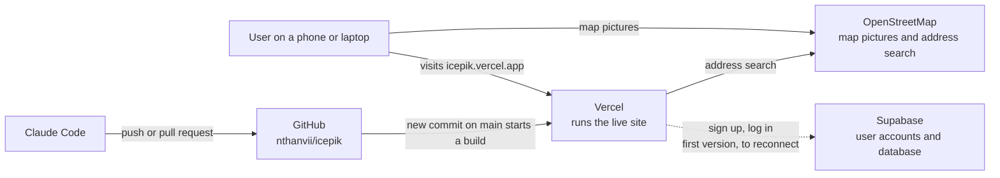

# ICEPik Walking Skeleton

ICEPik is a map where immigrants in Philadelphia can view ICE sightings and report them anonymously. Other users can then help verify each report. We're building it because ICE alerts spread through family group chats today, and as one person we interviewed put it, "The group chat is fast, but it can't tell you if what someone saw is real."

This walking skeleton proves the stack is connected. The live site shows the ICEPik map and design, but the reports on it are sample data.

**Live site:** https://icepik.vercel.app

**Team:** Sebastian Jeremiah, Nathan Inggita, Juan Melvin

---

## 1. Where does the code live?

On GitHub, in [nthanvii/icepik](https://github.com/nthanvii/icepik). Vercel deploys the live site from this repo's `main` branch. Juan works in a fork, [jmelv-git/icepik](https://github.com/jmelv-git/icepik), and sends changes back as pull requests. `main` on nthanvii/icepik is always the latest version.

The first version of the site was Vercel's Next.js and Supabase starter, which had working sign-up and login. We then rebuilt the site from Vercel's Next.js example to match our design mockup: a map, report cards, a report detail card and a "Know Your Rights" pop-up. That rebuild didn't carry the login code over, so sign-up and login aren't on the live site right now.

## 2. Where does the data live, and what is stored there right now?

Our user accounts are in Supabase, a database with user accounts built in. Right now the only thing stored there is the three accounts the team made in the first version of the site: each person's email address, when they signed up, and when they last logged in. Supabase stores passwords in a scrambled form, so nobody can read them, including us.

The reports on the map aren't in a database yet. They're sample data written into the code (`app/reports.ts`), so they're the same for every visitor and new reports aren't saved. The map pictures and the address search come from OpenStreetMap, and we don't store anything from them.

## 3. How does a change get from Claude Code to the live site?

1. We ask Claude Code to make a change in the code.
2. We check it at `localhost:3000` by running `npm run dev`.
3. We commit the change and push it to GitHub. Juan's changes go through a pull request from his fork into nthanvii/icepik.
4. Vercel sees the new commit on `main` and starts a new build on its own.
5. After about a minute the build shows **Ready** in Vercel, and the change is live at https://icepik.vercel.app.

## 4. What will we need to add to turn this into our team's app?

Our [Product Requirements Document](#where-these-plans-come-from) and Solution Proposal describe the first real version of ICEPik. To get there from this skeleton, we'd need to add:

- **Login again:** connect this codebase to our Supabase project. Accounts should stay optional, because people must be able to view and report sightings without giving us their email.
- **Philadelphia:** move the map and the sample reports from Fort Lauderdale, where the mockup's map was, to Philadelphia.
- **Saved reports:** a reports table in Supabase with the location, a description, the time, and whether the sighting is *suspected* (yellow pin) or *confirmed* (red camera pin). It won't store who sent the report.
- **Photos and videos:** a place to store them (Supabase Storage). A confirmed report needs one. Before storing a photo, we remove the hidden data inside it that can show where it was taken and on what phone.
- **Votes:** a votes table, so people can mark a sighting as real or not real.
- **Comments:** a comments table, linked to each report.
- **Usability:**
  - a short tutorial and a language choice on the first visit;
  - a translate button;
  - a legend that explains the pin colors;
  - an "Are they still there?" button that works.
- **Nearby alerts:** notifications limited to a small area around you. One complaint about the Citizen app was getting alerts from the other side of the country.

The "Know Your Rights" pop-up with links to legal resources is already built.

## 5. Diagram



The dotted line is the Supabase connection from the first version of the site. We still need to add it back.

---

## Screenshots

**Sign-up page on the first version of the site, with the web address showing**


**The page we saw after logging in to the first version**


**Our users in Supabase, under Authentication > Users**


**Vercel showing the deployment is Ready**


**Before our Claude Code changes:** the site was the Next.js Supabase Starter.


**After:** it's the ICEPik map, at https://icepik.vercel.app.


---

## Running it yourself

```bash
npm ci
npm run dev
```

Then open http://localhost:3000. Before you push, check that `npx eslint app` and `npx next build` pass.

## Where these plans come from

Our planning documents are the Research Report, the Persona Worksheet, the Solution Proposal and the Product Requirements Document. They're based on interviews with Indonesian immigrants in Philadelphia.

## License

MIT. See [LICENSE](LICENSE).
