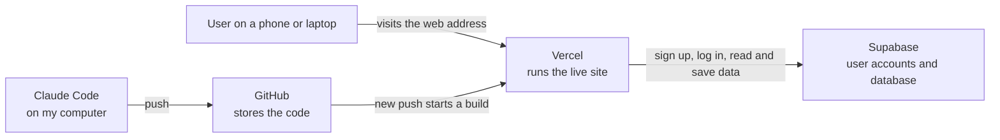
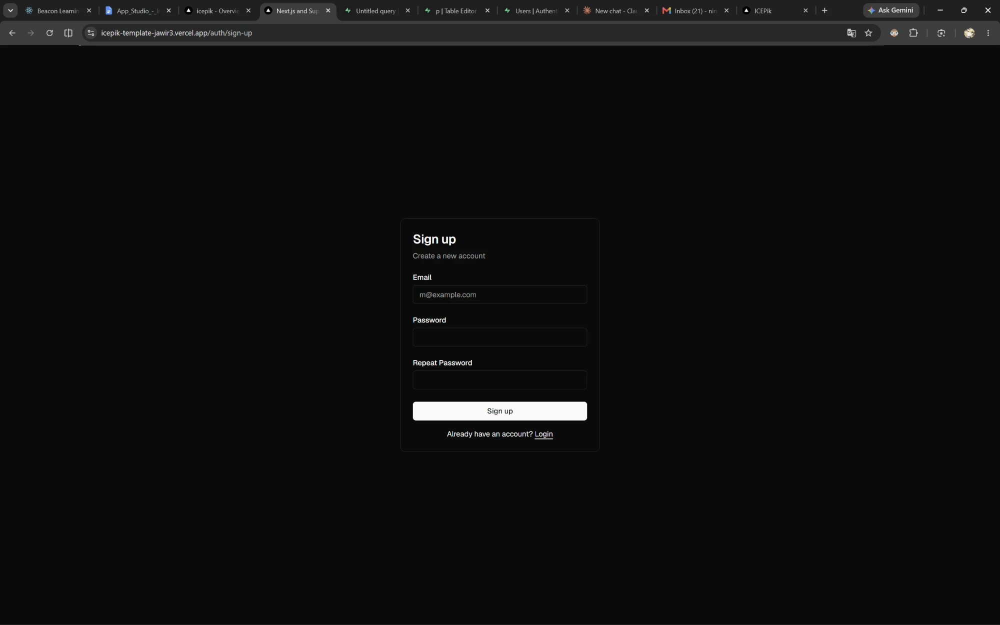
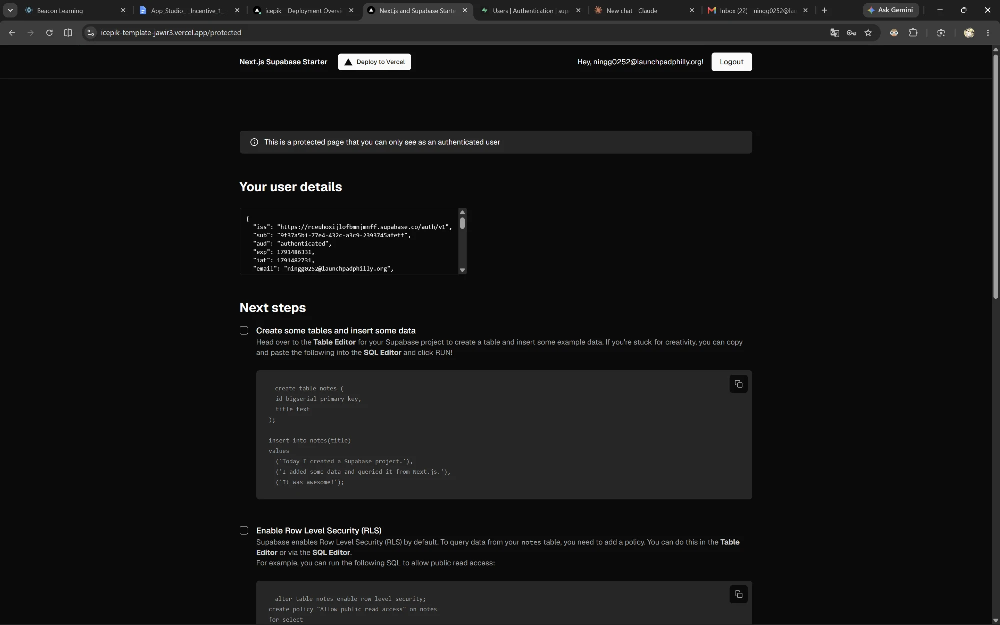
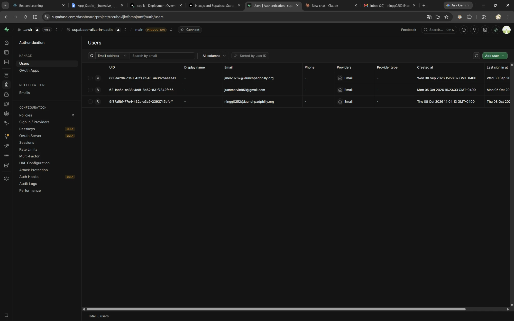
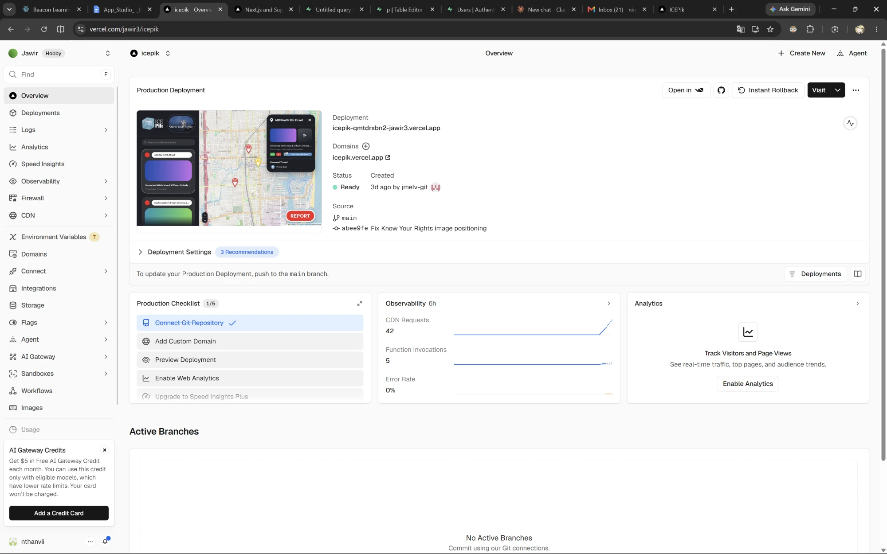
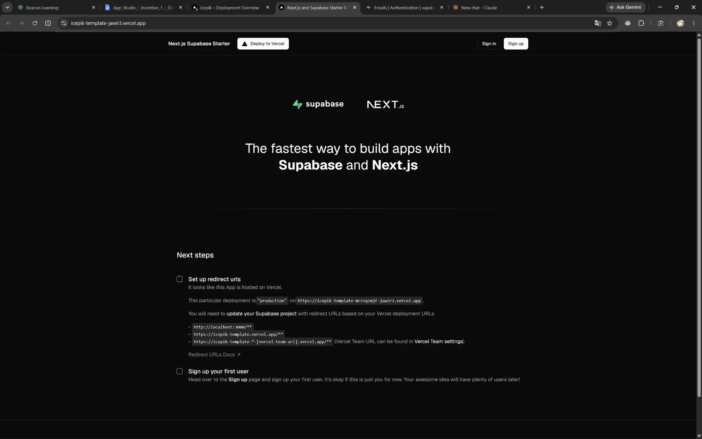
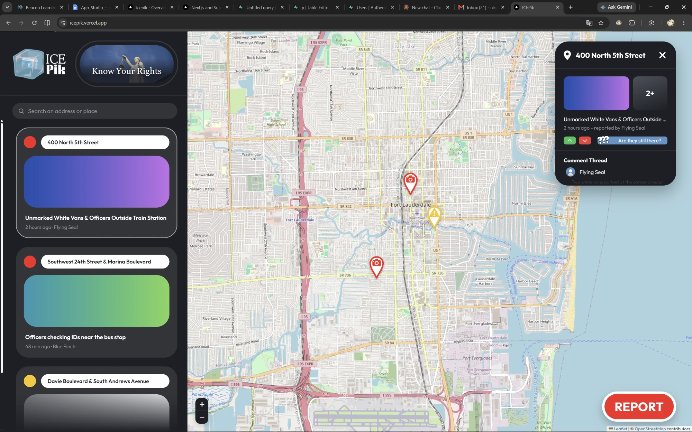

# ICEPik Walking Skeleton

ICEPik is a map where immigrants in Philadelphia can view ICE sightings and report them anonymously. Other users can then help verify each report. We're building it because ICE alerts spread through family group chats today, and as one person we interviewed put it, "The group chat is fast, but it can't tell you if what someone saw is real."

**Live site:** https://icepik.vercel.app

---

## 1. Where does the code live?

On GitHub, in [nthanvii/icepik](https://github.com/nthanvii/icepik). Vercel deploys the live site from this repo's `main` branch. Juan works in a fork, [jmelv-git/icepik](https://github.com/jmelv-git/icepik), and sends changes back as pull requests. `main` on nthanvii/icepik is always the latest version.

It started as Vercel's Next.js and Supabase starter. We then used Claude Code to build our design mockup on top of it: a map, report cards, a report detail card and a "Know Your Rights" pop-up.

## 2. Where does the data live, and what is stored there right now?

Our user accounts are in Supabase, a database with user accounts built in. Right now the only thing stored there is the team's three accounts: each person's email address, when they signed up, and when they last logged in. Supabase stores passwords in a scrambled form, so nobody can read them, including us.

The reports on the map aren't in a database yet. They're sample data written into the code (`app/reports.ts`), so they're the same for every visitor and new reports aren't saved. The map pictures and the address search come from OpenStreetMap, and we don't store anything from them.

## 3. How does a change get from Claude Code to the live site?

1. We ask Claude Code to make a change in the code.
2. We check it at `localhost:3000` by running `npm run dev`.
3. We commit the change and push it to GitHub. Juan's changes go through a pull request from his fork into nthanvii/icepik.
4. Vercel sees the new commit on `main` and starts a new build on its own.
5. After about a minute the build shows **Ready** in Vercel, and the change is live at https://icepik.vercel.app.

## 4. What will we need to add to turn this into our team's app?

Our [Product Requirements Document](#where-these-plans-come-from) and Solution Proposal describe the first real version of ICEPik. To get there from this skeleton, we'd need to add:

- **Optional accounts:** people must be able to view and report sightings without an account, so they never have to give us their email.
- **Philadelphia:** move the map and the sample reports from Fort Lauderdale, where the mockup's map was, to Philadelphia.
- **Saved reports:** a reports table in Supabase with the location, a description, the time, and whether the sighting is *suspected* (yellow pin) or *confirmed* (red camera pin). It won't store who sent the report.
- **Photos and videos:** a place to store them (Supabase Storage). A confirmed report needs one. Before storing a photo, we remove the hidden data inside it that can show where it was taken and on what phone.
- **Votes:** a votes table, so people can mark a sighting as real or not real.
- **Comments:** a comments table, linked to each report.
- **Usability:**
  - a short tutorial and a language choice on the first visit;
  - a translate button;
  - a legend that explains the pin colors;
  - an "Are they still there?" button that works.
- **Nearby alerts:** notifications limited to a small area around you. One complaint about the Citizen app was getting alerts from the other side of the country.

The "Know Your Rights" pop-up with links to legal resources is already built.

## 5. Diagram

---

## Screenshots

**Sign-up page on the live site, with the web address showing**

**The page we see after logging in**

**Our users in Supabase, under Authentication > Users**

**Vercel showing the deployment is Ready**

**Before our Claude Code changes:** the site was the Next.js Supabase Starter.

**After:** it's the ICEPik map, at https://icepik.vercel.app.

---

## License

MIT. See [LICENSE](LICENSE).
